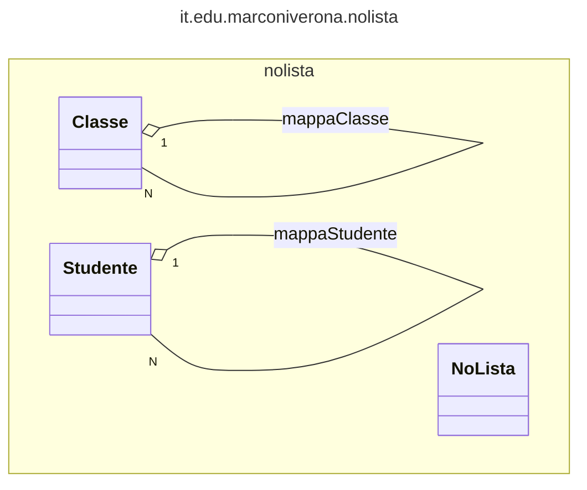
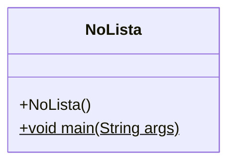
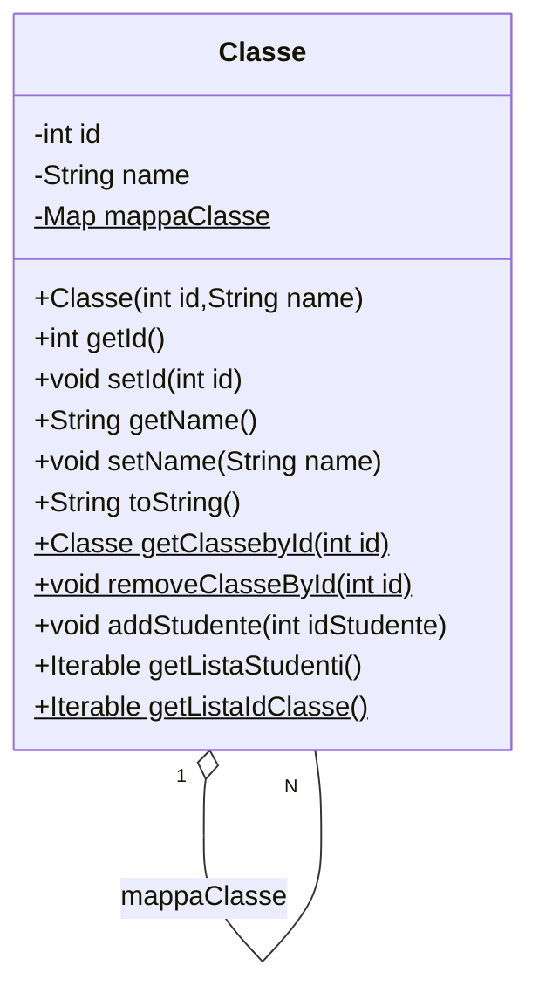
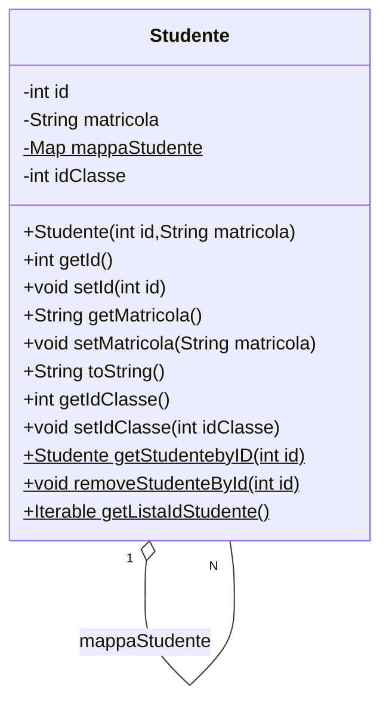

# Gestione di istanze di classi e studenti



Questo progetto Java dimostra l'utilizzo di una struttura dati basata su una mappa per gestire istanze di classi e studenti, gestendo l'associazione fra una classe ed i suoi studenti con un Iterable, invece che una lista. Sono fornite tre classi principali:

## NoLista.java



Questa classe contiene il metodo principale `main` che illustra l'utilizzo delle istanze di `Classe` e `Studente`. Viene creato un insieme di istanze di entrambe le classi, vengono aggiunti studenti alle classi e vengono visualizzate informazioni sulle classi e sugli studenti.

## Classe.java



Rappresenta un'entità di classe nel sistema. Ogni istanza di questa classe corrisponde a una classe nel sistema e mantiene una lista di ID studente associati ad essa. Alcuni metodi significativi includono:

- `getClassebyId(int id)`: Restituisce un'istanza di `Classe` corrispondente all'ID specificato.
- `removeClasseById(int id)`: Rimuove un'istanza di `Classe` corrispondente all'ID specificato.
- `addStudenteId(int idStudente)`: Aggiunge un ID studente alla lista di ID studente associati a questa istanza di classe.
- `getListaStudenti()`: Restituisce un iterabile di studenti associati a questa classe.
- `getListaIdClasse()`: Restituisce un iterabile di ID delle classi nel sistema.

## Studente.java



Rappresenta un'entità studente nel sistema. Ogni istanza di questa classe corrisponde a uno studente nel sistema e mantiene un mapping degli ID studente alle istanze studente. Alcuni metodi significativi includono:

- `getStudentebyID(int id)`: Restituisce l'istanza di `Studente` corrispondente all'ID specificato.
- `removeStudenteById(int id)`: Rimuove l'istanza di `Studente` corrispondente all'ID specificato.
- `getListaIdStudente()`: Restituisce un iterabile di ID degli studenti nel sistema.

## Utilizzo

Per utilizzare questo progetto, è sufficiente eseguire la classe `NoLista.java`, che contiene il metodo principale. È possibile modificare e aggiungere istanze di classi e studenti a piacimento per testare la funzionalità del codice.

```bash
javac NoLista.java
java NoLista
```
